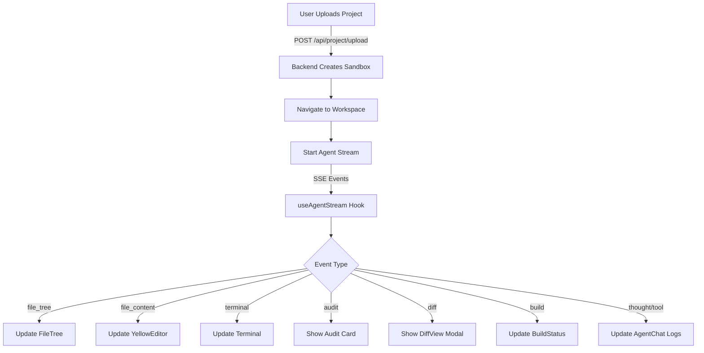

# Frontend SSE Integration & Sync Updates

## Overview

Extend the existing SSE-based architecture to support the full Yellow-fier workflow: project upload, real-time file sync, terminal output, audit display, diff review, and build monitoring. All communication uses SSE (no WebSocket needed).

## Current State Analysis

**Existing Components:**

- `useAgentStream.ts` - Basic SSE handler (thought, tool, code_update events)
- `AgentChat.tsx` - Chat interface with log display
- `YellowEditor.tsx` - Monaco editor wrapper
- `FileTree.tsx` - Mock file tree component
- `page.tsx` - Split-screen workspace layout

**Gaps:**

- No project upload flow
- No terminal output display
- FileTree uses mock data
- Editor doesn't sync with file changes
- No diff review UI
- No audit/build status display

## Architecture: SSE Event Flow



## Implementation Plan

### Phase 1: Type Definitions & Event Schema

**File: `frontend/src/lib/types.ts` (NEW)**

Define TypeScript interfaces for all SSE event types:

```typescript
// SSE Event Types
export type SSEEvent = 
  | ThoughtEvent 
  | ToolEvent 
  | FileTreeEvent 
  | FileContentEvent 
  | TerminalEvent 
  | AuditEvent 
  | DiffEvent 
  | BuildEvent 
  | CodeUpdateEvent;

export interface FileSystemNode {
  path: string;
  name: string;
  type: 'file' | 'folder';
  children?: FileSystemNode[];
}

export interface AuditResult {
  framework: string;
  currentPayment: string;
  proposedChanges: string[];
  feeSavings: string;
}

export interface DiffData {
  file: string;
  oldCode: string;
  newCode: string;
}
```

### Phase 2: Project Upload Component

**File: `frontend/src/components/upload/ProjectUpload.tsx` (NEW)**

Landing page component with:

- Drag-and-drop file upload zone
- GitHub URL input field
- Upload button
- Loading state during upload
- On success: navigate to `/workspace` (or set state to show workspace)

**API Integration:**

- `POST /api/project/upload` with FormData or JSON body
- Handle response and trigger workspace view

### Phase 3: Enhanced SSE Hook

**File: `frontend/src/hooks/useAgentStream.ts` (UPDATE)**

Extend to handle all event types:

```typescript
// Add new event handlers:
- file_tree: Update file tree state
- file_content: Update file contents map
- terminal: Append to terminal logs
- audit: Store audit result
- diff: Store pending diff
- build: Update build status
```

**State Management:**

- Return expanded state: `fileTree`, `fileContents`, `terminalLogs`, `auditResult`, `pendingDiff`, `buildStatus`
- Provide callbacks: `onFileTreeUpdate`, `onFileContentUpdate`, `onTerminalUpdate`, etc.

### Phase 4: Terminal Component

**File: `frontend/src/components/terminal/Terminal.tsx` (NEW)**

Display streaming terminal output:

- Scrollable container with monospace font
- Auto-scroll to bottom on new lines
- Format: `> command` for commands, plain text for output
- Filter events where `type === "terminal"`

**Integration:**

- Add to `page.tsx` layout (below editor or in chat panel)
- Connect to `useAgentStream` terminal logs

### Phase 5: File Tree Sync

**File: `frontend/src/components/editor/FileTree.tsx` (UPDATE)**

Replace mock data with real sync:

- Accept `fileTree: FileSystemNode | null` prop
- Update when SSE `file_tree` event arrives
- Highlight currently selected file
- Show indicators for modified/new files (optional)
- Maintain expand/collapse state

**File Selection:**

- On file click, emit event/callback to parent
- Parent updates `YellowEditor` with selected file content

### Phase 6: Editor File Sync

**File: `frontend/src/components/editor/YellowEditor.tsx` (UPDATE)**

Handle file switching and content updates:

- Accept `filePath: string | null` and `content: string` props
- Update editor when `filePath` or `content` changes
- Show "Agent is editing..." indicator when content updates
- Prevent user edits during agent operations (optional)

**State Management:**

- Track current file path
- Load content from `fileContents` map when file selected

### Phase 7: Diff Review Component

**File: `frontend/src/components/diff/DiffView.tsx` (NEW)**

Modal/overlay for reviewing code changes:

- Side-by-side or unified diff view
- Syntax highlighting
- Approve/Reject/Request Changes buttons
- On approve: send `POST /api/diff/approve` with file path

**Integration:**

- Show when `pendingDiff` exists in state
- Close on approve/reject
- Update agent state via SSE or API call

### Phase 8: Audit & Build Status UI

**File: `frontend/src/components/chat/AgentChat.tsx` (UPDATE)**

Add sections for:

- **Audit Card**: Display when `auditResult` exists
  - Show framework detection
  - Show proposed changes
  - Show fee savings estimate
  - "Proceed" / "Cancel" buttons
- **Build Status**: Display when `buildStatus !== "idle"`
  - Show progress indicator
  - Display build output/errors
  - Show success state with download button
- **Diff Prompt**: Show when `pendingDiff` exists
  - "Review Changes" button opens DiffView

### Phase 9: Global State Management

**File: `frontend/src/context/ProjectContext.tsx` (NEW)**

React Context for project state:

```typescript
interface ProjectState {
  isUploaded: boolean;
  projectName: string | null;
  fileTree: FileSystemNode | null;
  currentFile: string | null;
  fileContents: Record<string, string>;
  terminalLogs: string[];
  auditResult: AuditResult | null;
  pendingDiff: DiffData | null;
  buildStatus: 'idle' | 'building' | 'success' | 'error';
  buildOutput: string;
}
```

**Provider:**

- Wrap workspace page with `ProjectProvider`
- Update state from `useAgentStream` events
- Provide state and setters to all components

### Phase 10: Page Layout Updates

**File: `frontend/src/app/page.tsx` (UPDATE)**

Conditional rendering:

- If `!isUploaded`: Show `ProjectUpload`
- If `isUploaded`: Show workspace (current layout)

**Workspace Layout:**

- Add `Terminal` component (below editor or in chat panel)
- Connect all components to `ProjectContext`
- Ensure proper prop passing between components

### Phase 11: API Integration Helpers

**File: `frontend/src/lib/api.ts` (NEW)**

Centralized API functions:

- `uploadProject(files: File[] | githubUrl: string)`
- `approveDiff(file: string, approved: boolean)`
- `downloadProject()` - Trigger download when build succeeds

## Event Type Specifications

**Backend SSE Events (for reference):**

```typescript
// File system
{ type: "file_tree", tree: FileSystemNode }
{ type: "file_content", path: string, content: string }

// Terminal
{ type: "terminal", line: string }

// Agent workflow
{ type: "audit", analysis: AuditResult }
{ type: "diff", file: string, oldCode: string, newCode: string }
{ type: "build", status: "start" | "output" | "success" | "error", data?: string }

// Existing
{ type: "thought", content: string }
{ type: "tool", name: string, status: string }
{ type: "code_update", content: string } // Deprecated in favor of file_content
```

## File Structure After Updates

```
frontend/src/
├── app/
│   ├── page.tsx (UPDATED - conditional render)
│   └── layout.tsx
├── components/
│   ├── upload/
│   │   └── ProjectUpload.tsx (NEW)
│   ├── terminal/
│   │   └── Terminal.tsx (NEW)
│   ├── diff/
│   │   └── DiffView.tsx (NEW)
│   ├── chat/
│   │   └── AgentChat.tsx (UPDATED)
│   └── editor/
│       ├── FileTree.tsx (UPDATED)
│       └── YellowEditor.tsx (UPDATED)
├── hooks/
│   ├── useAgentStream.ts (UPDATED)
│   └── useEditorContext.ts
├── context/
│   └── ProjectContext.tsx (NEW)
└── lib/
    ├── types.ts (NEW)
    └── api.ts (NEW)
```

## Implementation Order

1. **Types & Context** - Define interfaces and global state structure
2. **ProjectUpload** - Enable project ingestion
3. **Enhanced useAgentStream** - Handle all event types
4. **Terminal Component** - Show command output
5. **FileTree Sync** - Connect to real file system
6. **Editor Sync** - Handle file switching
7. **DiffView** - Review changes
8. **AgentChat Updates** - Audit, build, diff UI
9. **Page Layout** - Conditional rendering
10. **API Helpers** - Centralized API calls

## Testing Considerations

- Verify SSE events are parsed correctly
- Test file tree updates on file creation/deletion
- Test editor content updates when agent writes files
- Test diff approval flow
- Test build status transitions
- Verify terminal auto-scroll
- Test project upload (drag-drop and GitHub URL)

## Notes

- No session management needed (single user, single sandbox)
- All sync happens via SSE (no WebSocket)
- Backend will emit these events from LangGraph nodes
- Monaco editor handles syntax highlighting automatically
- Use React state/context for simplicity (no Redux needed)